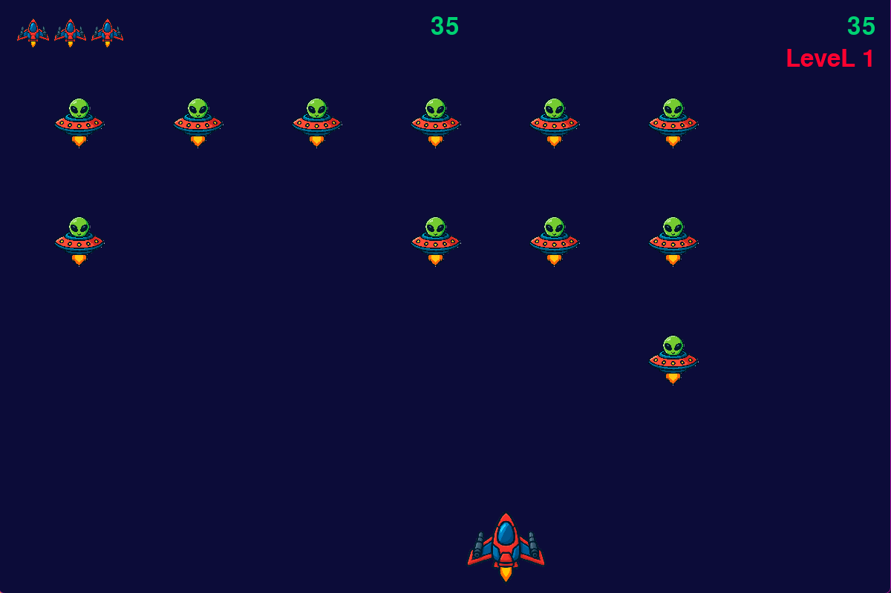
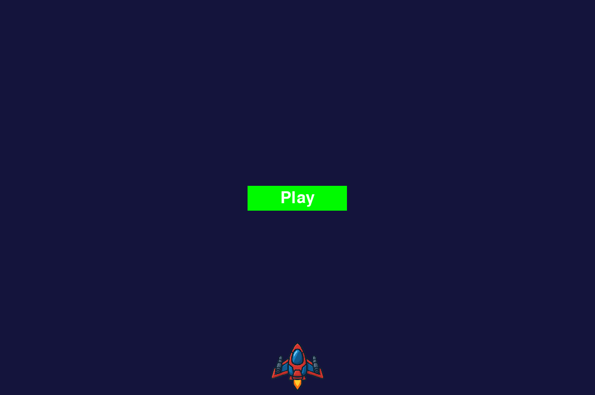
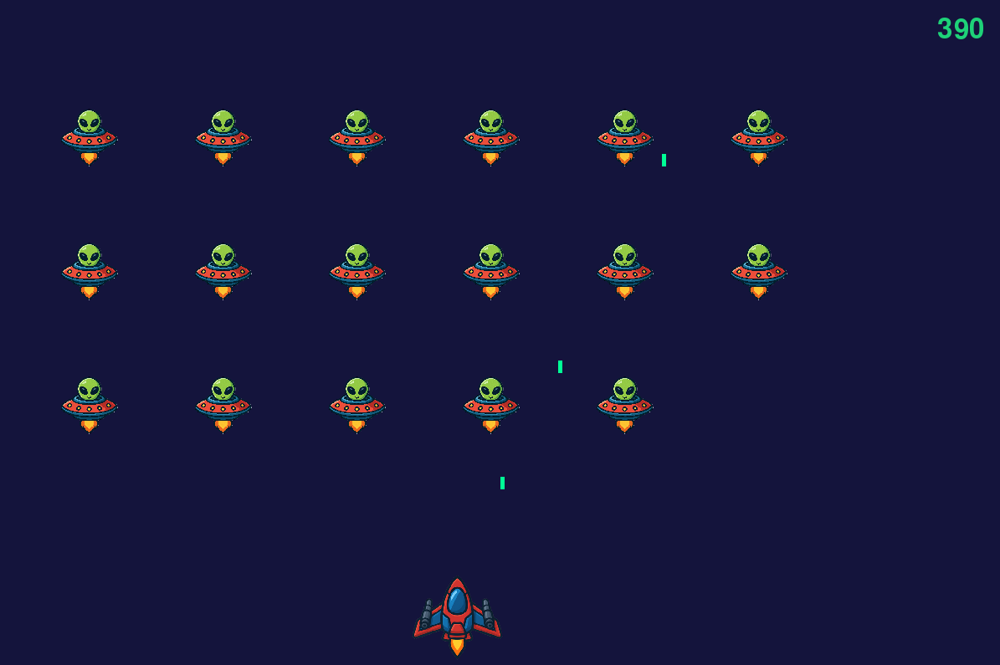

# ALIEN INVACION

#### Космический шутер, созданный по мотивам книги **"Python Crash Course"** от автора *Эрика Мэтиза* с собственными улучшениями и доработками.

___
## Управление

| Действие | Клавиша |  

| Движение влево | Стрелка влево |  
| Движение вправо | Стрелка вправо |  
| Стрельба | Пробел |  
| Начать/продолжить игру | Escape |  
| Пауза | Escape |  
| Выход из игры | Q |

## Особенности

**Мелкие изменения в управлении** - Escape для паузы и продолжения игры  

**Собственные звуки** - для живости игры добавлены уникальные звуки с вариациями  

**Уникальные текстуры** - созданы с помощью нейросетей

## Что реализовано
 - **Управление кораблем**
 - **Стрельба по врагам**
 - **Перемещение врагов**
 - **Уничтожение врагов при попадании пуль**
 - **Уничтожение собственного корабля при контакте с вражескими**
 - **Старт игры по кнопке "Play"**
 - **Увеличение сложности**
 - **Уникальная графика и звуки**
 - **Вывод рекордного счёта**

## Примечания

#### Это мой первый проект на Python, созданный в процессе изучения языка по книге "Python Crash Course". Код может содержать неоптимальные решения, но я активно учусь и улучшаю его.
#### В ближайших планах:
- **Вывод уровня игры**
- **Вывод количества жизней игрока**
- **Доработка звуков**
- **Добавить кнопку выход**

## Обновления
### v0.2.1
- **Добавлен вывод рекордного счёта**

## Технические детали

В игре используется библиотека "playsound3" вместо стандартного звукового модуля Pygame. Это связано с проблемами на некоторых системах.

## Скриншоты

### Стартовый экран

### Геймплей

