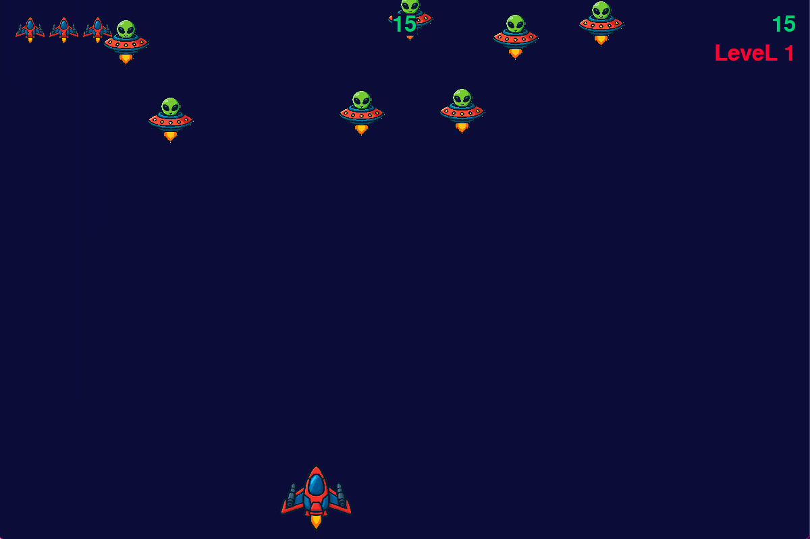
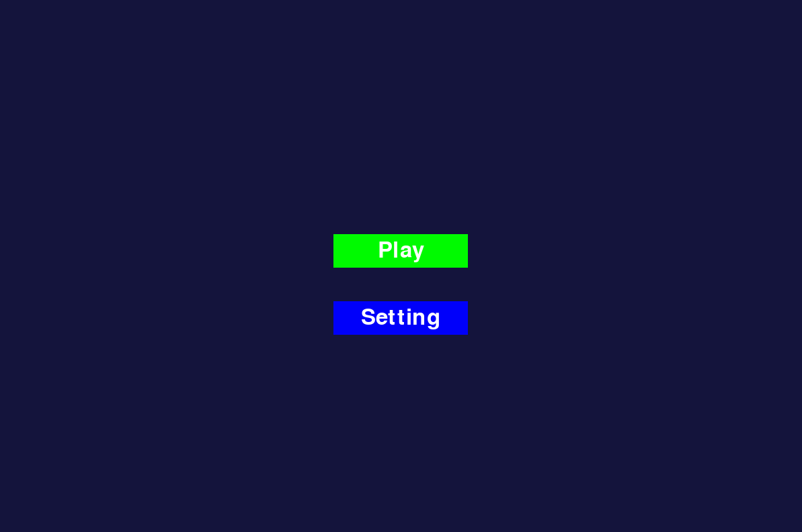
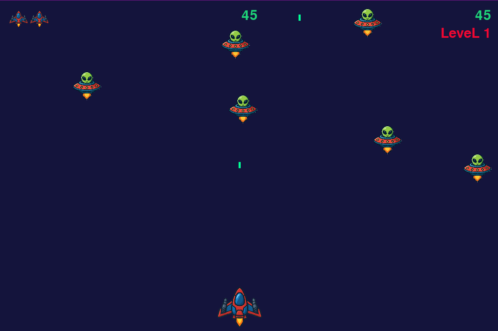

# ALIEN INVACION

#### Космический шутер, созданный по мотивам книги **"Python Crash Course"** от автора *Эрика Мэтиза* с собственными улучшениями и доработками.

___
## Управление

| Действие | Клавиша |  
| Движение влево | Стрелка влево |  
| Движение вправо | Стрелка вправо |  
| Стрельба | Пробел |  
| Продолжить игру / Пауза | Escape |    

## Особенности

**Удобное управление и меню** 

**Бонусы бафа характеристик**  

**Уникальная графика и зыуки** 

**Динамичный фон**

**Случайные движения инопланетян**

**Разные типы вражеских кораблей**

## Что реализовано
 - **Независимое перемещение врагов**
 - **Уничтожение врагов при попадании пуль**
 - **Уничтожение собственного корабля при контакте с вражескими**
 - **Старт игры по кнопке "NEW GAME"**
 - **Увеличение сложности**
 - **Уникальная графика и звуки**
 - **Вывод рекордного счёта и прочее**

## Примечания

#### Это мой первый проект на Python, созданный в процессе изучения языка по книге "Python Crash Course". Код может содержать неоптимальные решения, но я активно учусь и улучшаю его.
#### В ближайших планах:
- **Добавить астероиды**
- **Добавить бонус "Дополнительная жизнь"**
- **Добавить дебаф "Замедление"**
- **Добавить бонус "две пушки"**
- **Добавить дебаф "Слепота"**
- **Добавить Босса на 10 уровень**

## Обновления
### v0.5.7
- **Добавлен эффект взрыва от попаданий**
- **Новый эффект при получении бонусов**

## Технические детали

В игре используется библиотека "playsound3" вместо стандартного звукового модуля Pygame. Это связано с проблемами на некоторых системах.

## Скриншоты

### Стартовый экран

### Геймплей

